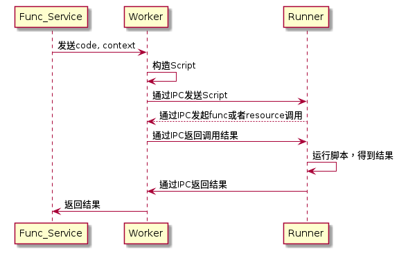

# vmbox 
   
  [English](./README.md)

  vmbox是为了解决node的vm模块不安全而诞生的`安全沙盒`，可以被用来运行不安全的js代码

  node提供了vm模块运行js代码，但是并不安全，无法用来运行不信任的代码。
  > The vm module is not a security mechanism. Do not use it to run untrusted code
  
  社区中提供了vm2能够运行不安全的代码，并且能够防御所有已知的攻击方法。但是仍然存在[异步死循环](https://github.com/patriksimek/vm2/issues/180)的问题。

  vmbox使用子进程隔离，对[vm2](https://github.com/patriksimek/vm2)进行了封装，解决了`异步死循环`的问题。

## Feature

  * 死循环强制退出（发生死循环kill子进程）
  * 跨进程函数调用（使用IPC跨进程调用函数）
  * 函数互相调用（借助context实现函数间调用）
  * 内部任务队列
  * 进程自治（杀死自启动）
  * 返回promise

## 安装
需要nodejs 6以上版本
```
npm install vmbox --save
```

## 使用举例
```javascript
const VMBox = require('vmbox');
const vmBox = new VMBox({
  timeout: 100,
  asyncTimeout: 500
});

const fn = `a = 10`;
vmBox.run(fn).then(console.log)
// 打印10
```
`timeout`是代码同步执行的时间， 默认100ms  
`asyncTimeout`限制代码异步执行的时间， 默认500ms

## 文档内容
* [背景](#背景)
* [vm2](#vm2)
* [用法](#用法)
* [原理](#原理)
* [贡献代码](#贡献代码)

## 背景
项目中有大量独立的js函数转化为API对外提供服务，并提供给多个项目调用，决定采用`faas`的思想将函数转变成API服务。vmbox是脱离云厂商，自建简单faas的核心功能。

项目调研中发现目前nodejs提供的vm和社区vm2均存在一些问题，为了服务的安全性和稳定性，对vm2进行了业务封装。

vmbox是被用来运行线上服务，因此要求函数尽可能`功能单一`、`依赖较少`，以保障vmbox减少超时(超时进程重启需要消耗大量的cpu资源)和良好的性能。

## vm2
vm2自身功能非常强大，vmbox封装了vm2最基本的功能，仅支持context功能注入，不支持node内建模块和自定义module

```javascript
// 内部调用vm2的方法
const { VM } = require('vm2');
const vm = new VM({ timeout, sandbox });
const result = await vm.run(code);
```

## 用法
vmbox的实例只有一个`run`方法，返回值是一个`promise`，接收三个参数

| 参数名 | 类型 | 是否选填 | 默认值 | 简介 |
|---|---|---|---|---|
|code|string| 必填 | - | 运行的js代码|
|context| object | 选填 | {} | 函数运行上下文 |
|stack | boolean | 选填 | false | 函数内调用其他函数，记录函数调用栈|

如果代码运行出错，会使用Promise.reject(error)抛出异常，需要对异常进行捕获

**基本用法**

```javascript
const VMBox = require('vmbox');
const vmBox = new VMBox({
  timeout: 100,
  asyncTimeout: 500
});

const context = {
  sum(a, b){
    return a + b;
  }
}

const fn = `sum(2, 3)`

vmBox.run(fn).then(console.log)
// 打印5
```

**高级用法**

借助函数运行上下文，可以做很多事情，下面实现了一个从函数内部调用其他函数的方法。
```javascript
const VMBox = require('vmbox');
const vmBox = new VMBox({
  timeout: 100,
  asyncTimeout: 500
});

const fnGroup = {
  sum: `async function main({params, fn}){
    const {a, b} = params;
    return a + b
  }`,
  caller: `async function main({params, fn}){
    return await fn.call('sum', params);
  }`
};

async function run(code, context, stack = false) {
  const runCode = code + `;\n(async () => { return await main({params, fn}); })()`
  return vmBox.run(runCode, context, stack);
}

const fn = {
  call: (name, params) => {
    const code = fnGroup[name];
    if (code) {
      return run(code, { params, fn }, true);
    } else {
      return null;
    }
  }
}

const context = {
  fn,
  params: {
    a: 10,
    b: 20
  }
}

const code = fnGroup.caller;
try {
  const res = await run(code, context);
  console.log(res); // 打印30
} catch (error) {
  console.log(error);
}
```
如果函数相互调用可能会形成调用闭环，运行500ms未结束，执行子进程会被杀死，启动新的子进程。

## 原理

1. `Func_Service`是应用程序
2. `Worker`和`Runner`是VMBox的部分
3. `Worker` 运行在主进程中
4. `Runner` 运行在子进程中，即代码运行的环境

## 贡献代码
本仓库是被用来构建faas服务，目前已在线上项目中使用，如果您在使用过程中发现问题，可以提交issue，我们会尽快修复，如果您有好的修改建议，可以提交pull request， 包含issue和解决方案。
